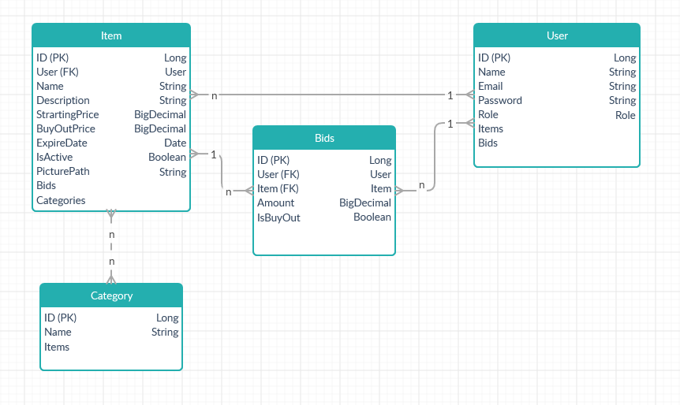

# CheapTrade

## 1. A projekt és a szoftver célja

Egy aukciós oldal létrehozása, ahol a bejelentkezett felhasználók szabadon tölthetnek fel saját, és licitálhatnak mások által feltöltött árucikkekre.

## 2. Feladat elemzés

### Főbb Lapok és funkciójuk

1. Főoldal:
Leírás, néhány kiemelt aukció megjelenítése
2. Aukciók:
Futó aukciók listája, lehetőség a termékekre való licitálásra
3. Saját termékek:
A felhasználó által feltöltött termékek listája, itt van lehetőség újak hozzáadására és meglévők törlésére
4. Kiemelt aukciók:
Azok amikre a felhasználó már licitált, és lehetősége van újabb licitet megadni
5. Bejelentkezés (nem bejelentkezett felhasználók számára)
Email/jelszó mező kitöltésével be lehet jelentkezni a már regisztrált felhasználóknak
6. Regisztráció:
A szükséges adatok kitöltésével lehet regisztrálni
7. Saját profil:
Felhasználó profiljának megtekintése, adatok módosítása

### Résztvevők

Három különböző esetet különböztetünk meg:

1. Vendégek (Nem bejelentkezett felhasználó): lehetősége van a főoldalt, a termékek listáját böngészni (licitálni nem), bejelentkezni és regisztrálni
2. Bejelentkezett felhasználó: lehetősége van a termékeket böngészni, licitálni, sajátokat feltölteni, azokat törölni, saját adatait módosítani
3. Bejelentkezett admin: elérhető számára az összes felhasználói funkció, azon felül bármely aukciót törölhet, módosíthat, és bármely felhasználót törölhet módosíthat

### Licitálás

Az eladó által megadott értékről indul, és a vevőnek az adott ár fölé kell licitálni mindig legalább egy megadott minimum értékkel. Az a licitáló kapja meg a terméket aki az aukciós idő lejárta előtt a legnagyobb összeggel licitált. A nyertes e-mailben kap értesítést az aukció sikeres megnyeréséről
Opcionálisan megadható egy kivásárlási ár, ekkor a vevő azonnal megszerezheti a terméket és azonnal lezárul a licit. 
Ha nem érkezik licit egy árura annak a lejárati dátuma előtt, akkor is lezárul az aukció, és senki nem kapja meg az árut.  

